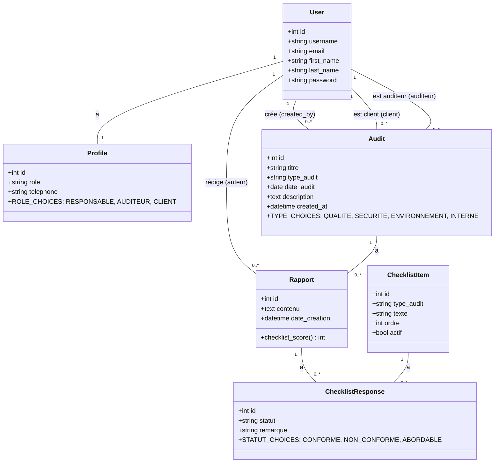
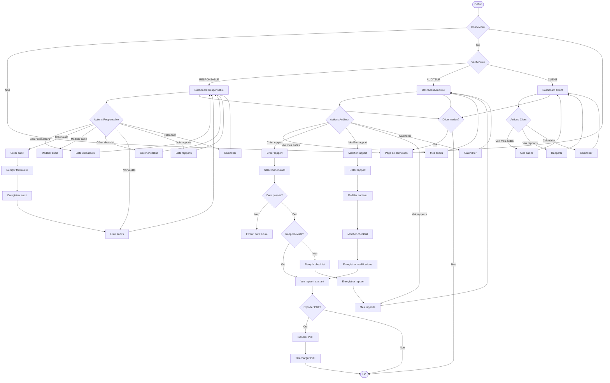
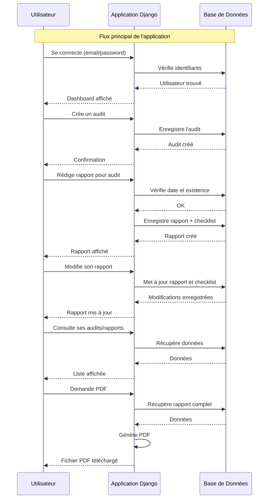
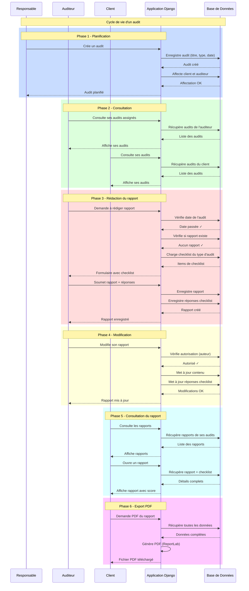
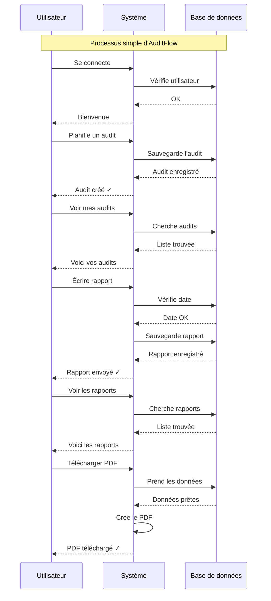
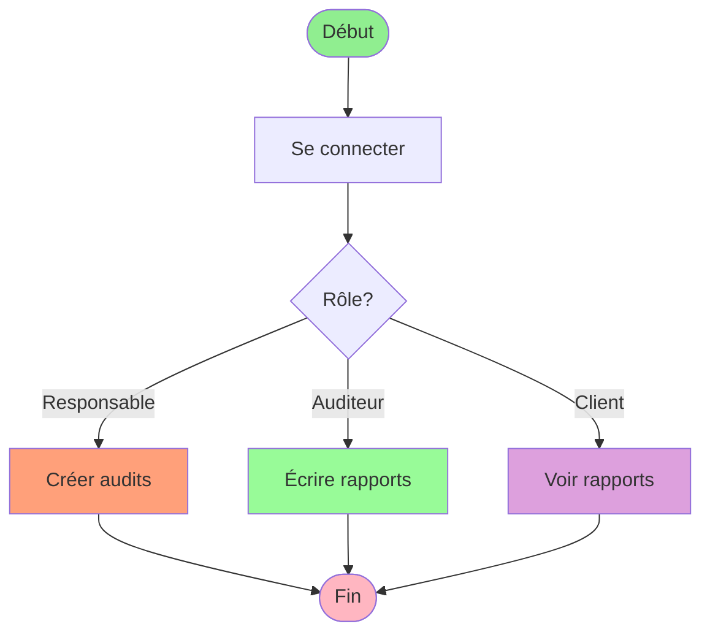

# Tous les Diagrammes - AuditFlow

Ce document contient tous les diagrammes de l'application AuditFlow en format Mermaid.

---

## 1. Diagramme de Classes



---

## 2. Diagramme de Flux



---

## 3. Diagramme d'Architecture

```mermaid
graph TB
    subgraph "Client (Navigateur)"
        Browser[Navigateur Web]
        Templates[Templates HTML]
    end
    
    subgraph "Django Application"
        subgraph "URL Routing"
            URLs[urls.py]
            ConfigURLs[config/urls.py]
        end
        
        subgraph "Views Layer"
            Views[views.py]
            AuthViews[login_view, register_view, logout_view]
            DashboardViews[dashboard]
            AuditViews[audits_list, audit_create, audit_update, audit_detail]
            RapportViews[rapports_list, rapport_create, rapport_detail, rapport_modifier, rapport_pdf]
            ChecklistViews[checklist_list, checklist_create]
            UserViews[users_list, user_create]
            CalendarView[calendar_view]
        end
        
        subgraph "Forms Layer"
            Forms[forms.py]
            UserForm[UserForm]
            RegisterForm[RegisterForm]
            AuditForm[AuditForm]
            RapportForm[RapportForm]
            RapportChecklistForm[RapportChecklistForm]
        end
        
        subgraph "Models Layer"
            Models[models.py]
            User[User - Django Auth]
            Profile[Profile]
            Audit[Audit]
            ChecklistItem[ChecklistItem]
            Rapport[Rapport]
            ChecklistResponse[ChecklistResponse]
        end
        
        subgraph "Decorators"
            Decorators[decorators.py]
            RoleRequired[role_required]
        end
        
        subgraph "Signals"
            Signals[signals.py]
        end
        
        subgraph "Management Commands"
            SeedDemo[seed_demo.py]
        end
    end
    
    subgraph "Database"
        SQLite[(SQLite - db.sqlite3)]
    end
    
    subgraph "Static Files"
        Static[static/]
        CSS[CSS]
        JS[JavaScript]
    end
    
    Browser --> ConfigURLs : HTTP Request
    ConfigURLs --> URLs
    URLs --> Views
    Views --> Forms : Validation
    Forms --> Models : CRUD Operations
    Models --> SQLite : Query
    SQLite --> Models : Return Data
    Models --> Views : Return Data
    Views --> Templates : Render
    Templates --> Browser : HTTP Response
    
    Views --> Decorators : Check Role
    Decorators --> Views : Allow/Deny
    
    Views --> Models : Use
    Models --> Signals : Auto-create Profile
    
    SeedDemo --> Models : Populate DB
    
    Templates --> Static : Load
```

---

## 4. Diagramme de Séquence (Version Simplifiée)



---

## 5. Diagramme de Séquence (Version par Rôle)



---

## 6. Diagramme de Séquence (Version Ultra-Simple)



---

## 7. Diagramme d'Activité (Version Ultra-Simple)



---

## 8. Diagramme des Cas d'Utilisation

```mermaid
flowchart TD
    Resp[Responsable Audit]
    Aud[Auditeur]
    Cli[Client]
    
    UC1[Se connecter]
    UC2[S'inscrire]
    UC3[Voir Dashboard]
    UC4[Créer un audit]
    UC5[Modifier un audit]
    UC6[Voir les audits]
    UC7[Voir le détail d'un audit]
    UC8[Créer un rapport]
    UC9[Modifier un rapport]
    UC10[Voir les rapports]
    UC11[Voir le détail d'un rapport]
    UC12[Exporter un rapport en PDF]
    UC13[Gérer les utilisateurs]
    UC14[Gérer les checklists]
    UC15[Voir le calendrier]
    
    Resp --> UC1
    Resp --> UC3
    Resp --> UC4
    Resp --> UC5
    Resp --> UC6
    Resp --> UC7
    Resp --> UC10
    Resp --> UC11
    Resp --> UC12
    Resp --> UC13
    Resp --> UC14
    Resp --> UC15
    
    Aud --> UC1
    Aud --> UC3
    Aud --> UC6
    Aud --> UC7
    Aud --> UC8
    Aud --> UC9
    Aud --> UC10
    Aud --> UC11
    Aud --> UC12
    Aud --> UC15
    
    Cli --> UC1
    Cli --> UC2
    Cli --> UC3
    Cli --> UC6
    Cli --> UC7
    Cli --> UC10
    Cli --> UC11
    Cli --> UC12
    Cli --> UC15
```



---

## Résumé

Ce document contient **8 diagrammes** couvrant tous les aspects de l'application AuditFlow :

1. **Diagramme de Classes** - Structure des modèles de données
2. **Diagramme de Flux** - Workflow complet de l'application
3. **Diagramme d'Architecture** - Structure technique MVT Django
4. **Diagramme de Séquence (Simplifié)** - Interactions principales
5. **Diagramme de Séquence (par Rôle)** - Cycle de vie d'un audit
6. **Diagramme de Séquence (Ultra-Simple)** - Version très simple
7. **Diagramme d'Activité (Ultra-Simple)** - Workflow minimal
8. **Diagramme des Cas d'Utilisation** - Fonctionnalités par rôle

Tous ces diagrammes sont disponibles en format Mermaid (.md) et PlantUML (.puml) dans le dossier `diagrammes/`.
