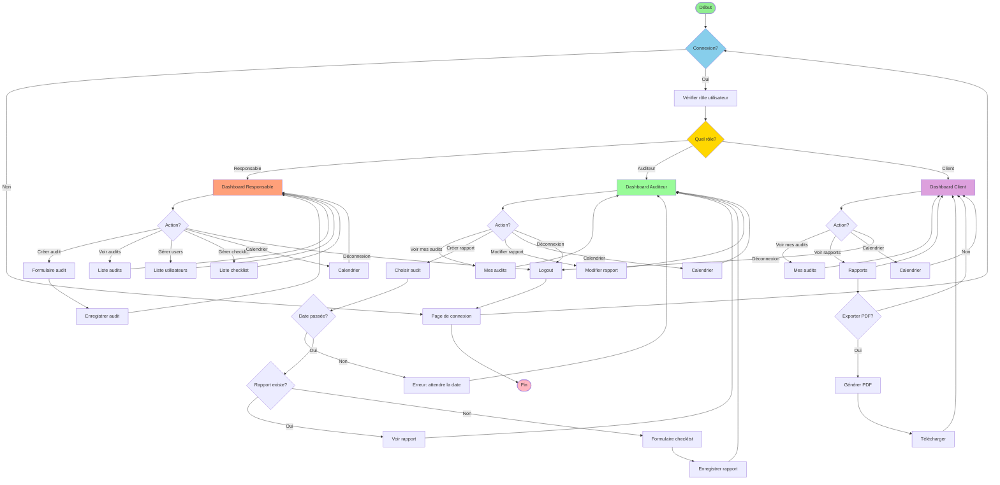

# Diagramme d'Activité - Workflow Global

## Description du workflow

### 1. Connexion
- L'utilisateur se connecte
- Le système vérifie son rôle
- Redirection vers le dashboard approprié

### 2. Dashboard Responsable
- Créer des audits
- Voir tous les audits
- Gérer les utilisateurs
- Gérer les checklists
- Voir le calendrier

### 3. Dashboard Auditeur
- Voir ses audits assignés
- Créer des rapports (après date de l'audit)
- Modifier ses rapports
- Voir le calendrier

### 4. Dashboard Client
- Voir ses audits
- Voir les rapports de ses audits
- Exporter les rapports en PDF
- Voir le calendrier
