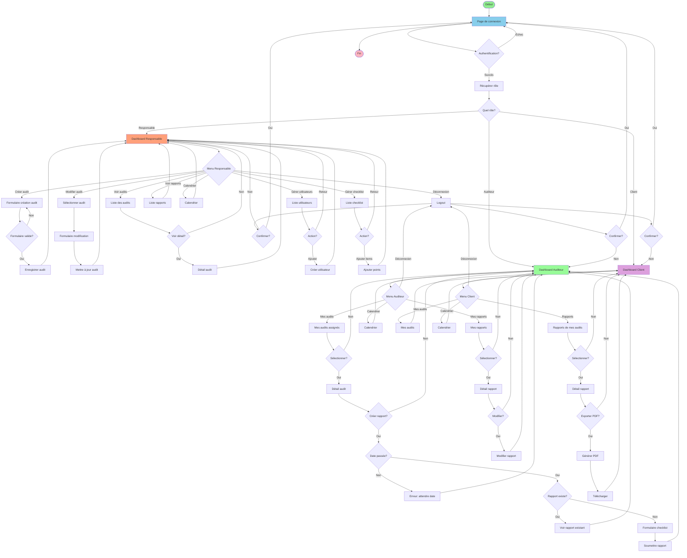

# Diagramme d'Activité - Workflow Complet

## Description détaillée du workflow

### Phase d'authentification
1. L'utilisateur accède à la page de connexion
2. Saisit email et mot de passe
3. Le système vérifie les identifiants
4. Si succès, récupère le rôle de l'utilisateur

### Workflow Responsable
- **Créer audit** : Formulaire de création → Validation → Enregistrement
- **Modifier audit** : Sélection → Formulaire → Mise à jour
- **Voir audits** : Liste → Détail optionnel
- **Gérer utilisateurs** : Liste → Ajout/Création
- **Gérer checklist** : Liste → Ajout de points
- **Voir rapports** : Consultation globale
- **Calendrier** : Vue calendrier

### Workflow Auditeur
- **Mes audits** : Liste des audits assignés → Détail → Option créer rapport
- **Création rapport** : Vérification date → Vérification existence → Formulaire checklist → Soumission
- **Mes rapports** : Liste → Détail → Option modification
- **Calendrier** : Vue calendrier

### Workflow Client
- **Mes audits** : Liste des audits demandés
- **Rapports** : Liste des rapports → Détail → Option export PDF
- **Calendrier** : Vue calendrier

### Déconnexion
- Confirmation avant déconnexion
- Retour à la page de connexion
