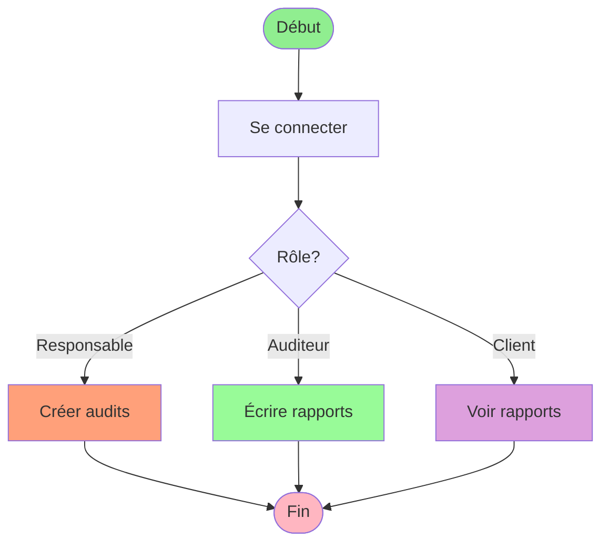

# Diagramme d'Activité - Version Ultra-Simple

## Workflow ultra-simple

1. **Se connecter**
2. **Selon le rôle** :
   - Responsable → Crée des audits
   - Auditeur → Écrit des rapports
   - Client → Voit les rapports
3. **Fin**
