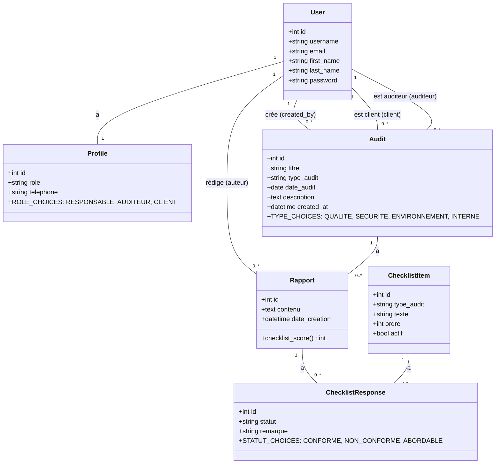

# Diagramme de Classes - Modèles de Données

## Description des Relations

- **User ↔ Profile** : Relation One-to-One (1:1)
- **User → Audit (created_by)** : Un utilisateur peut créer plusieurs audits
- **User → Audit (client)** : Un utilisateur peut être client de plusieurs audits
- **User → Audit (auditeur)** : Un utilisateur peut être auditeur de plusieurs audits
- **User → Rapport (auteur)** : Un utilisateur peut rédiger plusieurs rapports
- **Audit → Rapport** : Un audit peut avoir plusieurs rapports
- **Rapport → ChecklistResponse** : Un rapport peut avoir plusieurs réponses de checklist
- **ChecklistItem → ChecklistResponse** : Un item de checklist peut avoir plusieurs réponses
