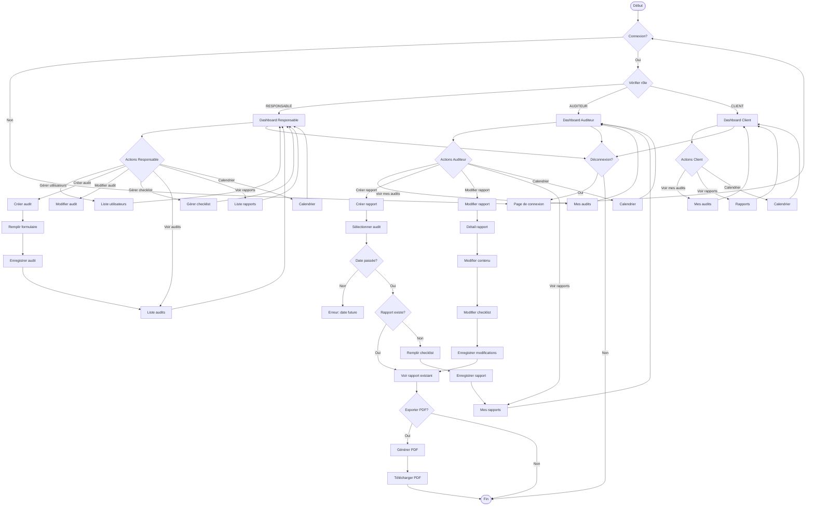

# Diagramme de Flux - Workflow de l'Application

## Description du Workflow

### 1. Authentification
- L'utilisateur se connecte via la page de login
- Le système vérifie les identifiants
- Le rôle de l'utilisateur est déterminé (RESPONSABLE, AUDITEUR, CLIENT)

### 2. Dashboard par Rôle
- **Responsable** : Accès complet à la gestion
- **Auditeur** : Accès limité à ses audits et rapports
- **Client** : Accès en lecture à ses audits et rapports

### 3. Flux Principal
- **Création d'audit** : Responsable planifie un audit avec client et auditeur
- **Création de rapport** : Auditeur rédige rapport après la date de l'audit
- **Checklist** : Points de contrôle évalués (Conforme/Non conforme/Abordable)
- **Modification** : Auditeur peut modifier son propre rapport
- **Export PDF** : Génération de rapport en PDF

### 4. Contrôles d'Accès
- Vérification de la date avant rédaction de rapport
- Un seul rapport par audit
- Accès restreint selon le rôle
