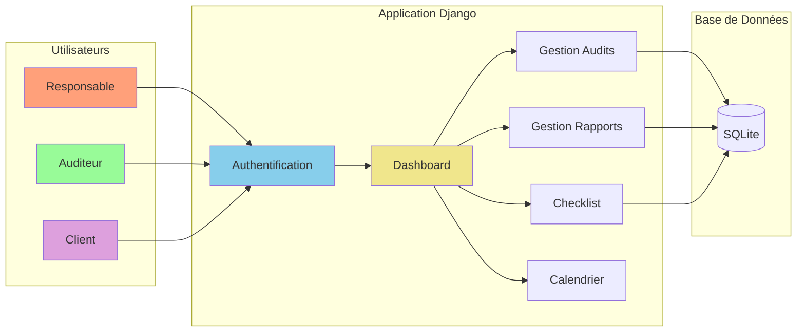

# Diagramme pour Présentation PFA - AuditFlow

## Architecture Simplifiée

**3 Types d'utilisateurs** :
- Responsable : Planifie les audits
- Auditeur : Réalise les audits et rédige les rapports
- Client : Consulte les rapports

**Fonctionnalités principales** :
- Authentification sécurisée
- Dashboard personnalisé par rôle
- Gestion des audits (création, modification)
- Gestion des rapports avec checklist
- Calendrier des audits

**Technologies** :
- Django (Framework web Python)
- SQLite (Base de données)
- ReportLab (Génération PDF)
