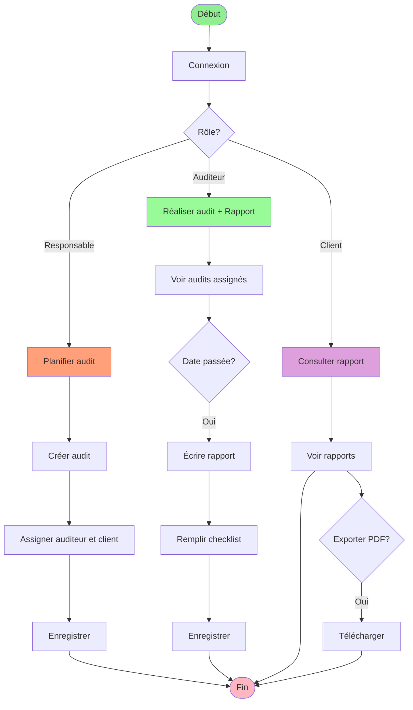

# Workflow Simplifié pour PFA

## Workflow de l'Application

### Étape 1 : Planification (Responsable)
- Créer un nouvel audit
- Définir le type, la date et la description
- Assigner un auditeur et un client

### Étape 2 : Exécution (Auditeur)
- Consulter les audits assignés
- Attendre la date de l'audit
- Rédiger le rapport avec checklist
- Évaluer chaque point (Conforme/Non conforme/Abordable)

### Étape 3 : Consultation (Client)
- Voir les rapports de ses audits
- Consulter le score de conformité
- Exporter en PDF si nécessaire
