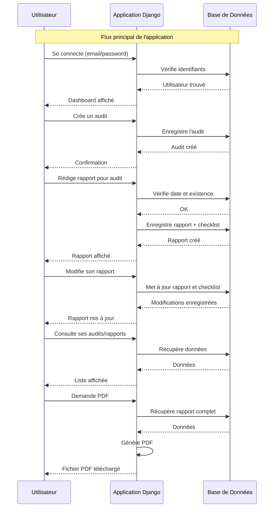

# Diagramme de Séquence - Version Simplifiée

```mermaid
sequenceDiagram
    participant User as Utilisateur
    participant App as Application Django
    participant DB as Base de Données

    Note over User,DB: Flux principal de l'application

    %% 1. Connexion
    User->>App: Se connecte (email/password)
    App->>DB: Vérifie identifiants
    DB-->>App: Utilisateur trouvé
    App-->>User: Dashboard affiché

    %% 2. Création d'audit (Responsable)
    User->>App: Crée un audit
    App->>DB: Enregistre l'audit
    DB-->>App: Audit créé
    App-->>User: Confirmation

    %% 3. Rédaction de rapport (Auditeur)
    User->>App: Rédige rapport pour audit
    App->>DB: Vérifie date et existence
    DB-->>App: OK
    App->>DB: Enregistre rapport + checklist
    DB-->>App: Rapport créé
    App-->>User: Rapport affiché

    %% 4. Modification de rapport (Auditeur)
    User->>App: Modifie son rapport
    App->>DB: Met à jour rapport et checklist
    DB-->>App: Modifications enregistrées
    App-->>User: Rapport mis à jour

    %% 5. Consultation (Client)
    User->>App: Consulte ses audits/rapports
    App->>DB: Récupère données
    DB-->>App: Données
    App-->>User: Liste affichée

    %% 6. Export PDF
    User->>App: Demande PDF
    App->>DB: Récupère rapport complet
    DB-->>App: Données
    App->>App: Génère PDF
    App-->>User: Fichier PDF téléchargé
```
