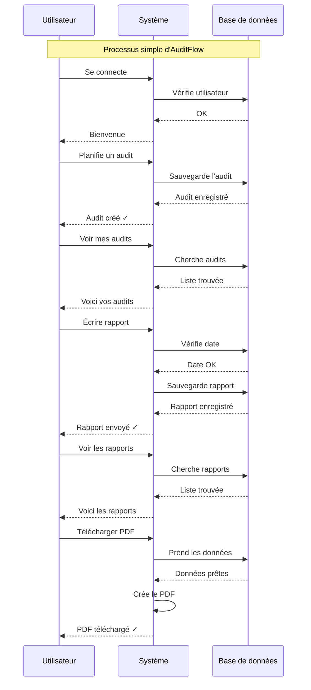

# Diagramme de Séquence - Version Ultra-Simple

## Explication simple

1. **Connexion** : L'utilisateur se connecte avec email et mot de passe
2. **Planifier** : Le responsable crée un nouvel audit
3. **Voir** : L'auditeur consulte les audits qui lui sont assignés
4. **Rédiger** : L'auditeur écrit le rapport après l'audit
5. **Consulter** : Le client voit les rapports de ses audits
6. **Exporter** : N'importe qui peut télécharger le rapport en PDF
