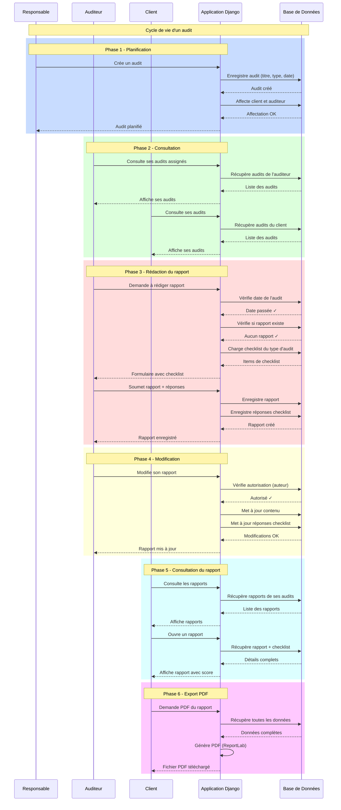

# Diagramme de Séquence - Version par Rôle

## Description par Phase

### Phase 1 - Planification (Responsable)
- Création de l'audit avec titre, type et date
- Affectation d'un client et d'un auditeur
- Confirmation de la planification

### Phase 2 - Consultation (Auditeur et Client)
- L'auditeur voit ses audits assignés
- Le client voit ses audits demandés
- Accès au calendrier partagé

### Phase 3 - Rédaction du rapport (Auditeur)
- Vérification que la date de l'audit est passée
- Vérification qu'aucun rapport n'existe déjà
- Chargement de la checklist selon le type d'audit
- Soumission du rapport avec les réponses de checklist

### Phase 4 - Modification (Auditeur)
- Vérification que l'auditeur est l'auteur
- Modification du contenu textuel
- Mise à jour des réponses de checklist

### Phase 5 - Consultation du rapport (Client)
- Liste des rapports de ses audits
- Détail du rapport avec score de conformité
- Visualisation des réponses de checklist

### Phase 6 - Export PDF (Tous les rôles)
- Récupération de toutes les données du rapport
- Génération du PDF avec ReportLab
- Téléchargement du fichier
